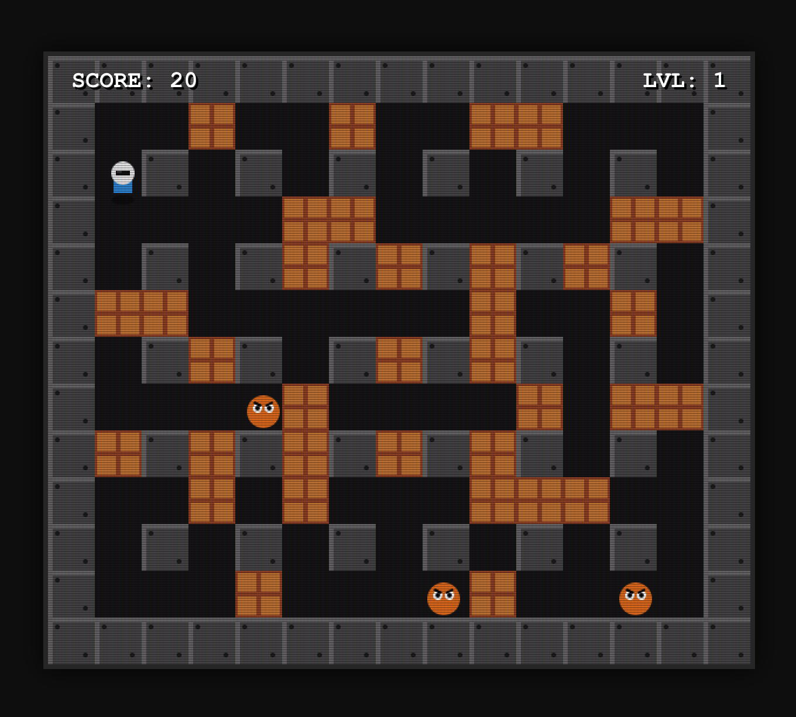

# Proton Payload

A retro-style arcade game built with **TypeScript**, **Vite**, and the **HTML5 Canvas API**. This project recreates the classic Bomberman experience with destructible environments, power-ups, and increasing difficulty levels.

## 📸 Screenshot

<!-- Insert a screenshot of the game here -->


## 🚀 Features

*   **Classic Gameplay**: Drop bombs, destroy soft walls, and eliminate enemies to progress.
*   **Procedural Levels**: Each level is generated with a random layout of soft walls.
*   **Power-ups**:
    *   `☢` **Range**: Increases explosion radius.
    *   `💣` **Bombs**: Increases the number of bombs you can place simultaneously.
    *   `⚡` **Speed**: Increases player movement speed.
*   **Smart AI**: Enemies navigate the grid and change direction upon collision.
*   **Retro Aesthetics**: CRT scanline effects, pixelated graphics, and screen shake.
*   **Responsive Controls**: Keyboard support for desktop and touch controls for mobile devices.

## 🛠️ Tech Stack

*   **Language**: TypeScript
*   **Bundler**: Vite
*   **Rendering**: HTML5 Canvas (2D Context)
*   **Package Manager**: Yarn

## 📦 Getting Started

### Prerequisites

*   Node.js (v16 or higher)
*   Yarn

### Installation

1.  Clone the repository:
    ```bash
    git clone https://github.com/your-username/atomic-bomberman-clone.git
    cd atomic-bomberman-clone
    ```

2.  Install dependencies:
    ```bash
    yarn install
    ```

### Running Development Server

Start the local development server:

```bash
yarn dev
```

Open your browser and navigate to `http://localhost:5173`.

### Building for Production

Create a production-ready build:

```bash
yarn build
```

The output will be generated in the `dist` directory.

## 🎮 Controls

### Desktop
*   **Arrow Keys**: Move Up, Down, Left, Right
*   **Spacebar**: Drop Bomb

### Mobile
*   **D-Pad (On-screen)**: Move
*   **Bomb Button**: Drop Bomb

## 🧪 Testing

Run the test suite using Vitest:

```bash
yarn test
```
